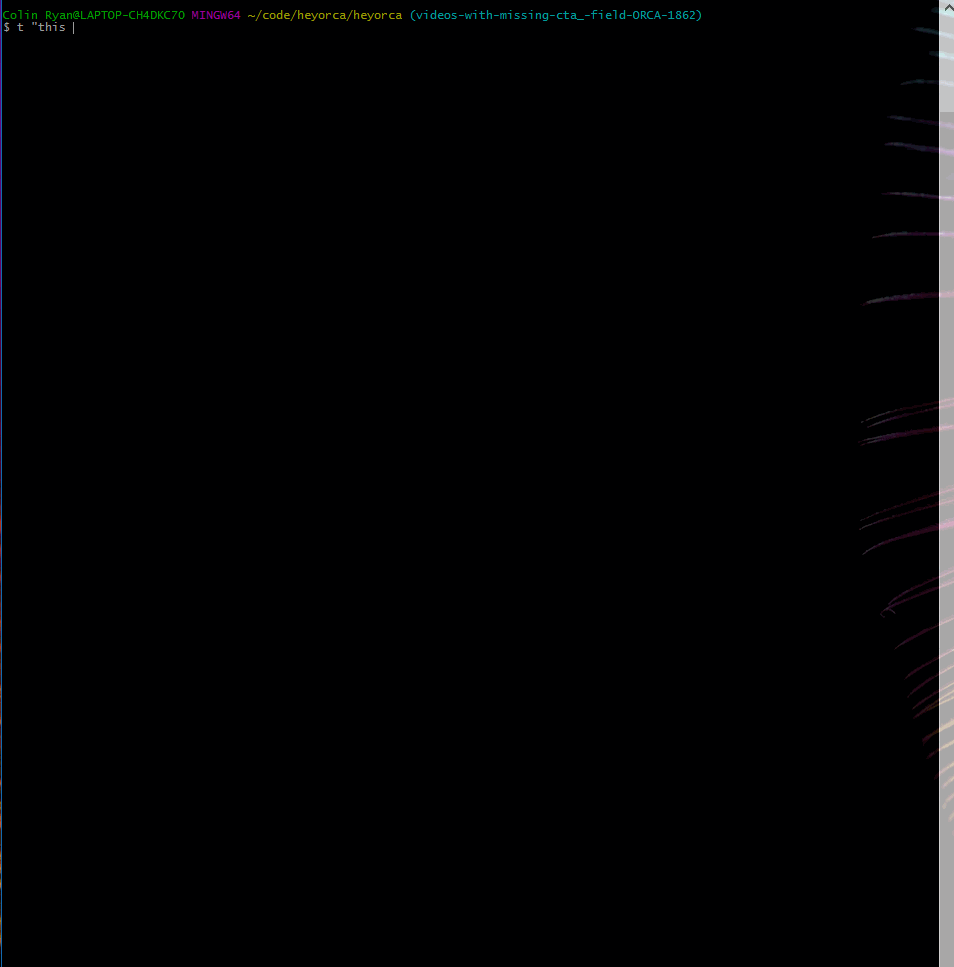

# todo-cli
A simple todo app in bash

## Demo



## Usage 
```
t          - Shows a list of todo's
t "A TODO" - Adds a new todo to the list 
tt         - Used to strikeout todo's
```
## Installation

You mean, add it to .bashrc?

run this in your cli
```
curl https://raw.githubusercontent.com/ColinRyan/todo-cli/master/index.sh >>
~/.bashrc && . ~/.bashrc
```

## Config (optional)
For .bashrc (Open the todo list directly in vim)
```
alias vt='vim ~/.todo'
```


For .inputrc (Ctrl+t will put 't ""' in your cli and place the cursor between the quotes
```
C-t:'t ""\e[D'
```

## Contribute

I'll accept a pull request as long as usage stays simple.
I don't care what language you write in but I will request that all code be able to live in .bashrc.

## Licence

MIT
